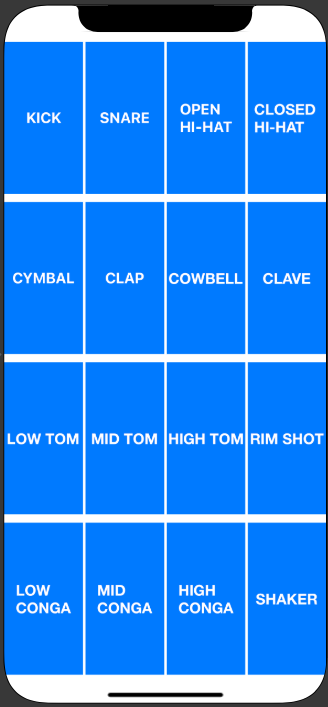

#  Drum Machine iOS

Continued learning with Swift. Building the first stages of the Drum Sequencer by building a drum machine.

Drum machine completed in Swift (UIKit) using the AV Foundation library.
App designed to fit any screen size and also can be rotated.

Player loads up app and is presented with 16 buttons. Each button has a different drum sound. Tap away and enjoy making some beats!

## TO RUN APP -

1. Hit the green 'Code' button on this repo and copy the link to clone project
2. Load up xcode.
3. Under Source Control, click 'Clone'
4. Paste link into window and click 'Clone'
5. Navigate to where project is to be saved
6. Once opened, Run project and play!

### Launch Screen

### Main App Screen

